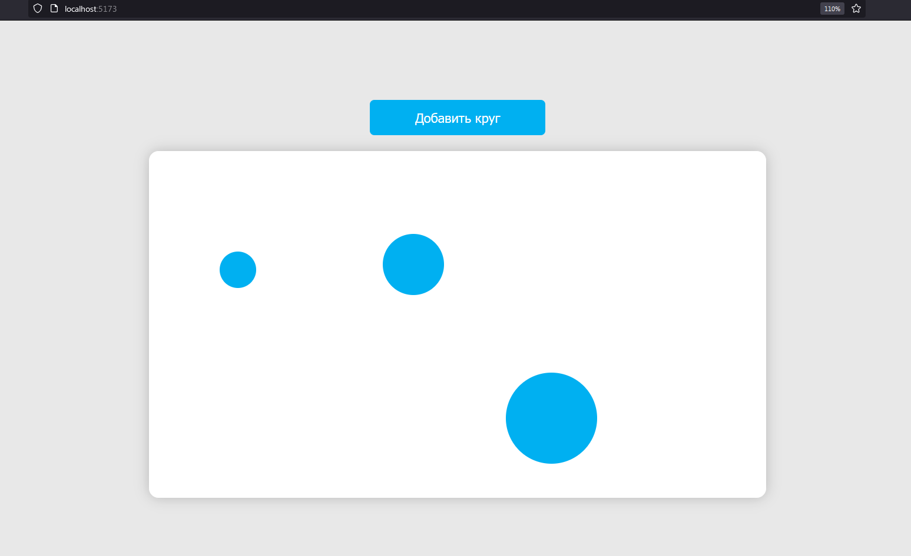

# Задание кейс-чемпионата «Пчела» 2024 для веб-разработчиков 

## Содержание
- [Инструкция по запуску проекта](#инструкция-по-запуску-проекта)
- [Доступный функционал](#доступный-функционал)
- [Чек-лист](#чек-лист)

## Инструкция по запуску проекта
### Шаг 1: С помощью Git клонируйте данный репозиторий
```
git clone https://github.com/yaesonaaa/case_powepoint_fight.git
```
### Шаг 2: Запуск сервера разработки
Запустите терминал и убедитесь, что у вас установлен Node.js. <p>
Проверить это можно, выполнив следующие команды:
`node -v`
`npm -v`<p>
После этого вам необходимо выполнить следующие команды:<p>
```
cd your-path-to-directory
npm start
npm run dev
```
### Шаг 3: Откройте браузер:
После запуска сервера, на экране появится ссылка http://localhost:5173/. По этому адресу в браузере будет доступно ваше приложение.<p>
<p text-align="center"></p>

## Доступный функционал
- При нажатии на кнопку «Добавить круг» в области слайда добавится кружочек
- Пользователь может перемещать круг внутри области слайда, перетаскивая его мышкой
- Удаление одного круга с помщью клавиши Backspace
- Выделение нескольких кругов осуществляется нажатием по кругам правой кнопкой мыши
- Несколько выделенных кругов можно одновременно переместить или удалить

## Чек-лист
- [x] При нажатии на кнопку «Добавить круг» в область слайда 
будет добавлен элемент в виде круга в рандомном месте рандомного размера от 5% до
20% от ширины слайда. 
- [x] Для добавленных кругов должна быть возможность 
свободного перемещения (перетаскивания мышкой) внутри области слайда.
- [x] Добавить функцию удаления круга с помощью клавиши «Backspace»
- [x] Добавить возможность выделения нескольких кругов для одновременного 
удаления или перемещения. 
- [x] Корректная работа функционала не только в Google Chrome, но и в Яндекс 
Браузер, Firefox, Safari и Opera. 

